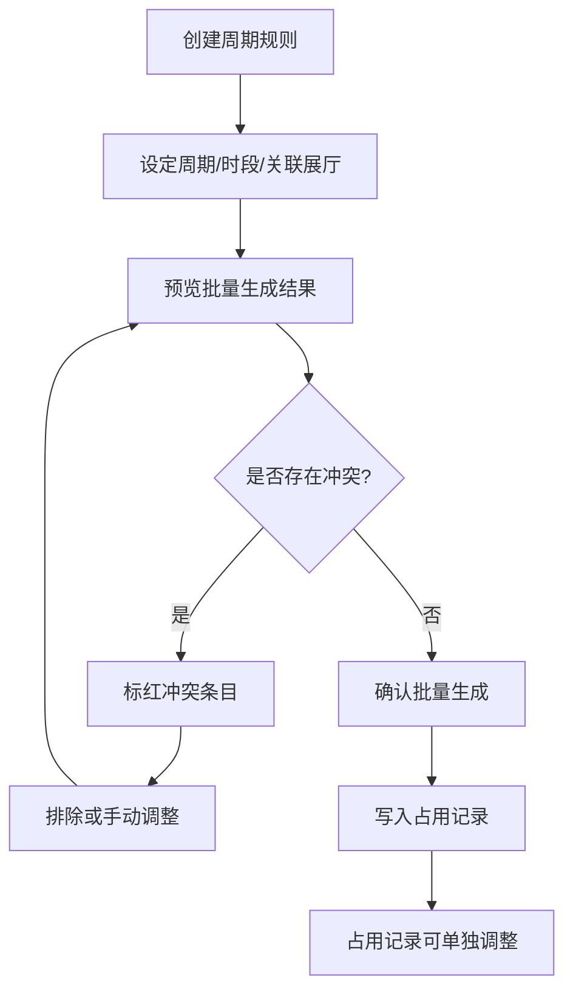
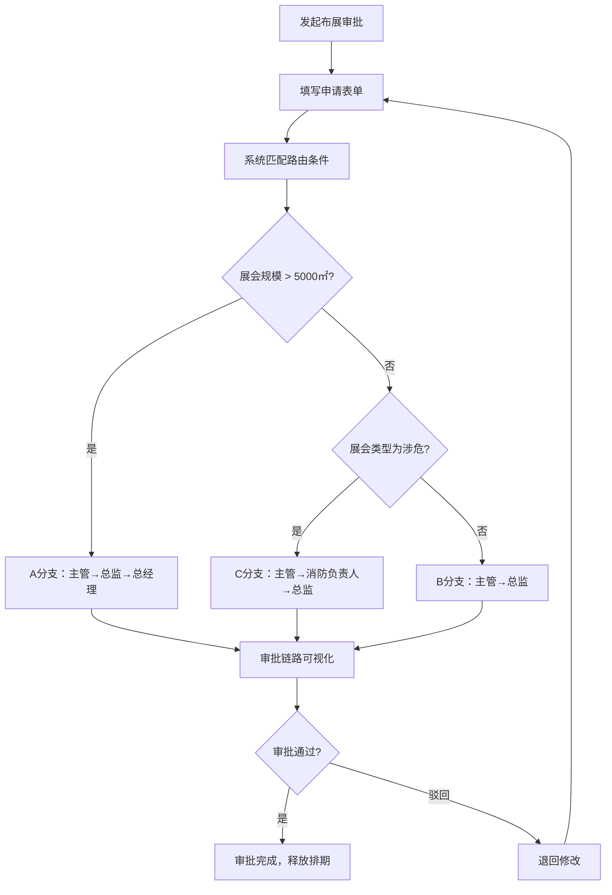
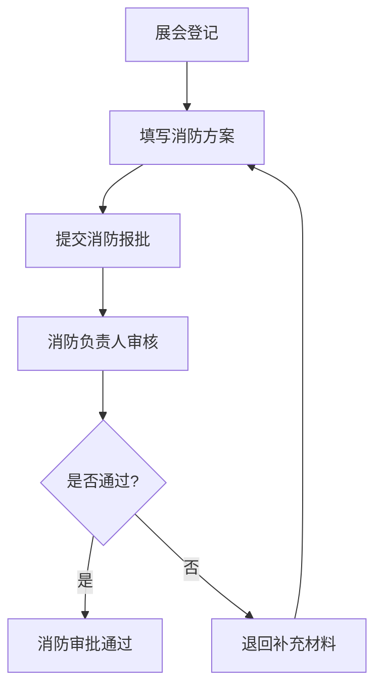

## 1. 产品概述

会展场馆排期移动端管理系统，面向会展中心运营团队，解决多展厅排期冲突、周期性招商例会批量生成、布展申请分支审批等核心痛点。系统通过可配置的条件路由引擎，让不同规模和类型的展会自动走对应审批分支，避免硬编码，实现审批流程灵活可调。

- 目标用户：会展中心运营主管、展厅管理员、招商专员、消防安全负责人
- 核心价值：降低排期冲突率，提升审批流转效率，消除周期性排期的重复劳动

## 2. 核心功能

### 2.1 用户角色

| 角色 | 注册方式 | 核心权限 |
|------|----------|----------|
| 运营主管 | 管理员分配 | 全部模块读写、审批路由配置、审批终审 |
| 展厅管理员 | 管理员分配 | 展厅建档、排期调整、占用确认 |
| 招商专员 | 管理员分配 | 展会登记、发起布展审批、查看排期 |
| 消防负责人 | 管理员分配 | 消防方案审批、消防安全检查 |

### 2.2 功能模块

1. **首页仪表盘**：排期概览、待办审批、即将开展展会、冲突预警
2. **展厅排期**：展厅列表与状态、排期日历视图、占用详情与调整、展厅建档
3. **周期生成**：周期规则管理、批量生成预览与确认、单条调整覆盖
4. **分支审批**：审批列表、审批发起、条件路由配置、审批链可视化
5. **展会登记**：展会列表、展会登记表单、消防方案报批

### 2.3 页面详情

| 页面名称 | 模块名称 | 功能描述 |
|----------|----------|----------|
| 首页仪表盘 | 排期概览卡片 | 展示各展厅当前占用状态概要，标注冲突 |
| 首页仪表盘 | 待办审批 | 列出当前用户待处理的审批条目，支持快速跳转 |
| 首页仪表盘 | 即将开展 | 近7天即将开展的展会列表 |
| 首页仪表盘 | 冲突预警 | 检测排期冲突并红色高亮提醒 |
| 展厅列表 | 展厅卡片 | 展示各展厅名称、面积、当前状态（空闲/占用/维护） |
| 展厅列表 | 快捷筛选 | 按状态、面积范围筛选展厅 |
| 展厅建档 | 基本信息 | 展厅名称、面积、层高、承重、位置等属性 |
| 展厅建档 | 设施配置 | 水电接口、网络、消防设施等配置 |
| 展厅建档 | 可用时段 | 设定展厅的默认可排期时段 |
| 排期日历 | 日历视图 | 月/周视图切换，颜色区分占用类型（招商例会/展会/布展/撤展） |
| 排期日历 | 占用条目 | 点击日期查看当日占用详情，支持滑动切换周 |
| 占用详情 | 详情展示 | 展会名称、占用时段、占用类型、联系人 |
| 占用详情 | 单条调整 | 对批量生成的占用进行单独日期/时段调整 |
| 占用详情 | 冲突检测 | 调整后自动检测是否与新时段冲突 |
| 周期规则列表 | 规则卡片 | 展示规则名称、周期类型、关联展厅、下次执行时间 |
| 周期规则列表 | 启停控制 | 规则的启用/停用开关 |
| 规则编辑 | 基本信息 | 规则名称、关联展厅（多选）、周期类型（周/双周/月） |
| 规则编辑 | 时段设定 | 每周几的哪个时段，支持多时段 |
| 规则编辑 | 生效范围 | 起止日期、跳过节假日选项 |
| 批量生成预览 | 预览列表 | 展示即将生成的占用条目列表，冲突项标红 |
| 批量生成预览 | 确认生成 | 确认后批量写入占用记录 |
| 批量生成预览 | 单条排除 | 勾选排除不需要的条目后再生成 |
| 审批列表 | 待办/已办 | Tab 切换待办和已办审批 |
| 审批列表 | 筛选排序 | 按类型、紧急程度、时间排序 |
| 审批发起 | 选择类型 | 选择布展申请/消防报批等审批类型 |
| 审批发起 | 填写表单 | 展会信息、布展方案、消防方案等 |
| 审批发起 | 提交审批 | 提交后系统根据路由规则自动分配审批分支 |
| 条件路由配置 | 路由列表 | 展示所有审批路由规则及条件 |
| 条件路由配置 | 条件编辑 | 添加/编辑条件（展会规模、类型等），设定匹配的审批分支 |
| 条件路由配置 | 分支节点 | 配置各分支的审批人节点和顺序 |
| 审批详情 | 审批信息 | 展会详情、申请材料、当前审批状态 |
| 审批详情 | 链路可视化 | 以流程图形式展示审批链路，标注当前节点和已完成节点 |
| 审批详情 | 审批操作 | 同意/驳回/退回/加签 |
| 展会列表 | 列表展示 | 展会名称、展厅、日期、状态（筹备/布展/开展/撤展/已结束） |
| 展会列表 | 筛选搜索 | 按状态、展厅、关键词搜索 |
| 展会登记 | 基本信息 | 展会名称、主办单位、规模、类型、预计人流量 |
| 展会登记 | 展厅选择 | 多选展厅及各展厅占用时段 |
| 展会登记 | 附件上传 | 展会方案、布展图纸等材料 |
| 消防方案报批 | 方案填写 | 消防安全方案、灭火器材配置、疏散通道规划 |
| 消防方案报批 | 提交报批 | 提交至消防负责人审批 |

## 3. 核心流程

### 3.1 周期性排期生成流程

招商专员设定周期规则（如"每周三 9:00-17:00 招商例会"），系统按规则批量生成未来占用记录。生成的占用可单独调整日期或时段，调整时自动检测冲突。

### 3.2 分支审批流程

招商专员发起布展审批，系统根据可配置的条件路由（展会规模 > 5000㎡ 走A分支，≤ 5000㎡ 走B分支；涉危类型走C分支），自动选择审批链路。审批人可在链路可视化中查看当前进度。

### 3.3 消防方案报批流程

## 4. 用户界面设计

### 4.1 设计风格

- **主色调**：深石板蓝 (#1B2838) 作为主背景，搭配琥珀金 (#D4A853) 作为强调色，传达专业稳重的会展行业气质
- **辅助色**：浅灰蓝 (#2D3E50) 卡片背景，翡翠绿 (#2ECC71) 表示可用，珊瑚红 (#E74C3C) 表示冲突/紧急
- **按钮风格**：圆角胶囊按钮（8px圆角），主按钮为琥珀金实心，次按钮为描边
- **字体**：标题使用 Noto Serif SC 衬线体营造正式感，正文使用 Noto Sans SC 无衬线体保证可读性
- **布局风格**：移动端卡片式布局，底部Tab导航，顶部搜索栏，下拉刷新
- **图标风格**：线性图标，1.5px 描边，与整体专业风格统一

### 4.2 页面设计概览

| 页面名称 | 模块名称 | UI元素 |
|----------|----------|--------|
| 首页仪表盘 | 排期概览 | 横向滚动展厅状态卡片，琥珀金进度条，深色卡片 |
| 首页仪表盘 | 待办审批 | 列表项左滑操作，红点角标，右侧箭头 |
| 首页仪表盘 | 即将开展 | 时间轴样式，日期标签+展会名，颜色编码类型 |
| 首页仪表盘 | 冲突预警 | 红色警示卡片，脉冲动画，点击跳转详情 |
| 展厅列表 | 展厅卡片 | 大面积状态色块+面积信息，右上角状态标签 |
| 展厅建档 | 表单 | 分组卡片式表单，字段标签在上方，输入框无边框底线样式 |
| 排期日历 | 日历视图 | 周视图为主，时间轴纵向排列，占用色块横向铺展 |
| 排期日历 | 占用条目 | 圆角色块+文字，点击弹出底部Sheet详情 |
| 周期规则列表 | 规则卡片 | 左侧周期图标，右侧启停Switch，底部下次执行时间 |
| 规则编辑 | 时段设定 | 周几选择器（圆形容器），时段选择器（滑块） |
| 批量生成预览 | 预览列表 | 条目卡片+勾选框，冲突项红色边框+警告图标 |
| 审批列表 | 列表项 | 左侧状态圆点，中部摘要信息，右侧紧急度标签 |
| 审批发起 | 表单 | 步骤式表单，顶部进度条，底部固定提交按钮 |
| 条件路由配置 | 路由卡片 | 条件标签组+分支流程缩略图，点击展开编辑 |
| 审批详情 | 链路可视化 | 纵向流程图节点，已完成绿色，当前琥珀金脉冲，待办灰色 |
| 审批详情 | 审批操作 | 底部固定操作栏，同意/驳回按钮 |
| 展会列表 | 列表项 | 左侧展会类型图标，中部名称+展厅+日期，右侧状态标签 |
| 展会登记 | 登记表单 | 分步表单（基本信息→展厅时段→附件），步骤指示器 |
| 消防方案报批 | 方案表单 | 结构化表单，消防器材配置为可增删行表格 |

### 4.3 响应式设计

- 移动优先设计，主要适配 375px-428px 宽度手机屏幕
- 底部Tab导航固定4个入口：首页、排期、审批、登记
- 触控优化：最小点击区域 44px，滑动操作支持左滑删除/操作
- 横屏时日历视图自动切换为更宽的时间轴展示

### 4.4 动效设计

- 页面切换：右侧滑入/左侧滑出，300ms
- 卡片点击：缩放0.98反馈，150ms
- 审批链路：节点逐个淡入，脉冲动画标识当前节点
- 冲突预警：红色脉冲呼吸动画
- 下拉刷新：自定义琥珀金刷新指示器
