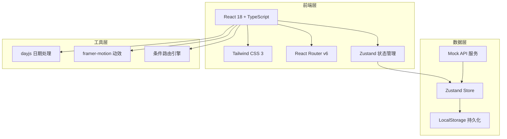
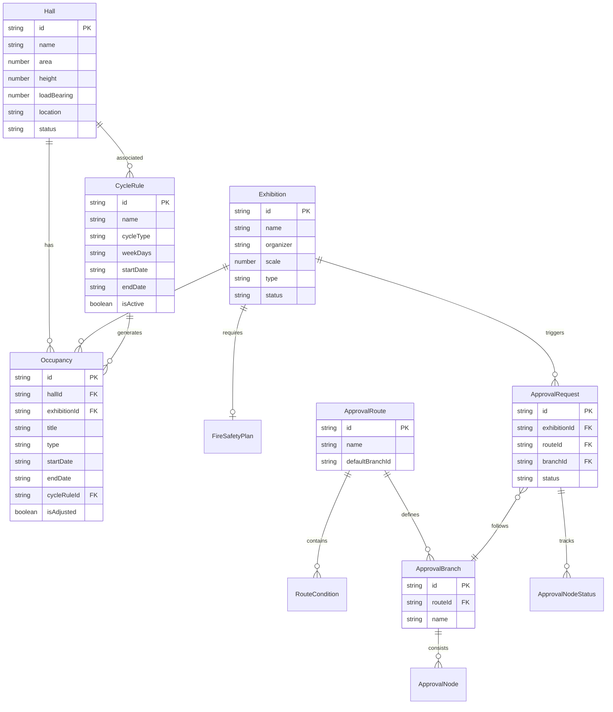

## 1. 架构设计



## 2. 技术说明

- **前端框架**：React@18 + TypeScript + Vite
- **初始化工具**：Vite (react-ts 模板)
- **样式方案**：Tailwind CSS@3 + CSS Variables 主题
- **路由方案**：React Router v6 (移动端底部Tab + 嵌套路由)
- **状态管理**：Zustand (轻量级，适合移动端)
- **日期处理**：dayjs (轻量，含插件)
- **动效库**：framer-motion (审批链路动画、页面切换)
- **后端服务**：无，使用 Mock 数据 + LocalStorage 持久化
- **数据库**：无，前端 Zustand store + LocalStorage

## 3. 路由定义

| 路由 | 用途 | 底部Tab |
|------|------|---------|
| `/` | 首页仪表盘 | 首页 |
| `/halls` | 展厅列表 | 排期 |
| `/halls/:id` | 展厅详情/排期日历 | 排期 |
| `/halls/new` | 展厅建档 | 排期 |
| `/halls/:id/edit` | 编辑展厅 | 排期 |
| `/schedule/:hallId` | 展厅排期日历 | 排期 |
| `/occupancy/:id` | 占用详情与调整 | 排期 |
| `/cycles` | 周期规则列表 | 排期 |
| `/cycles/new` | 新建周期规则 | 排期 |
| `/cycles/:id/edit` | 编辑周期规则 | 排期 |
| `/cycles/:id/preview` | 批量生成预览 | 排期 |
| `/approvals` | 审批列表 | 审批 |
| `/approvals/new` | 发起审批 | 审批 |
| `/approvals/:id` | 审批详情/链路可视化 | 审批 |
| `/routing/config` | 条件路由配置 | 审批 |
| `/exhibitions` | 展会列表 | 登记 |
| `/exhibitions/new` | 展会登记 | 登记 |
| `/exhibitions/:id` | 展会详情 | 登记 |
| `/fire-safety/:exhibitionId` | 消防方案报批 | 登记 |

## 4. API 定义（Mock）

### 4.1 展厅相关

```typescript
interface Hall {
  id: string;
  name: string;
  area: number;
  height: number;
  loadBearing: number;
  location: string;
  facilities: string[];
  availableHours: { start: string; end: string };
  status: "available" | "occupied" | "maintenance";
}

// GET /api/halls -> Hall[]
// GET /api/halls/:id -> Hall
// POST /api/halls -> Hall
// PUT /api/halls/:id -> Hall
```

### 4.2 占用记录

```typescript
interface Occupancy {
  id: string;
  hallId: string;
  exhibitionId?: string;
  title: string;
  type: "investment_meeting" | "exhibition" | "setup" | "teardown" | "maintenance";
  startDate: string;
  endDate: string;
  startTime: string;
  endTime: string;
  cycleRuleId?: string;
  contactPerson?: string;
  contactPhone?: string;
  isAdjusted: boolean;
}

// GET /api/occupancies?hallId=&startDate=&endDate= -> Occupancy[]
// POST /api/occupancies -> Occupancy
// PUT /api/occupancies/:id -> Occupancy
// DELETE /api/occupancies/:id -> void
// POST /api/occupancies/batch -> Occupancy[]
```

### 4.3 周期规则

```typescript
interface CycleRule {
  id: string;
  name: string;
  hallIds: string[];
  cycleType: "weekly" | "biweekly" | "monthly";
  weekDays: number[];
  timeSlots: { start: string; end: string }[];
  startDate: string;
  endDate: string;
  skipHolidays: boolean;
  isActive: boolean;
  title: string;
  type: Occupancy["type"];
}

// GET /api/cycle-rules -> CycleRule[]
// POST /api/cycle-rules -> CycleRule
// PUT /api/cycle-rules/:id -> CycleRule
// POST /api/cycle-rules/:id/generate -> { occupancies: Occupancy[], conflicts: Occupancy[] }
```

### 4.4 审批相关

```typescript
interface ApprovalRoute {
  id: string;
  name: string;
  conditions: RouteCondition[];
  branches: ApprovalBranch[];
  defaultBranchId: string;
}

interface RouteCondition {
  id: string;
  field: string;
  operator: "gt" | "gte" | "lt" | "lte" | "eq" | "in" | "contains";
  value: string | number | string[];
  branchId: string;
}

interface ApprovalBranch {
  id: string;
  name: string;
  nodes: ApprovalNode[];
}

interface ApprovalNode {
  id: string;
  title: string;
  role: string;
  order: number;
}

interface ApprovalRequest {
  id: string;
  type: "setup" | "fire_safety" | "other";
  exhibitionId: string;
  exhibitionName: string;
  routeId: string;
  branchId: string;
  currentNodeIndex: number;
  status: "pending" | "approved" | "rejected" | "returned";
  nodes: ApprovalNodeStatus[];
  formData: Record<string, any>;
  createdAt: string;
  updatedAt: string;
}

interface ApprovalNodeStatus {
  nodeId: string;
  title: string;
  role: string;
  status: "pending" | "approved" | "rejected" | "current";
  operator?: string;
  operatedAt?: string;
  comment?: string;
}

// GET /api/approval-routes -> ApprovalRoute[]
// POST /api/approval-routes -> ApprovalRoute
// PUT /api/approval-routes/:id -> ApprovalRoute
// GET /api/approvals?status=&type= -> ApprovalRequest[]
// POST /api/approvals -> ApprovalRequest
// PUT /api/approvals/:id/action -> ApprovalRequest
```

### 4.5 展会相关

```typescript
interface Exhibition {
  id: string;
  name: string;
  organizer: string;
  scale: number;
  type: string;
  categories: string[];
  expectedVisitors: number;
  hallIds: string[];
  startDate: string;
  endDate: string;
  status: "preparing" | "setup" | "running" | "teardown" | "ended";
  attachments: string[];
  fireSafetyStatus: "not_submitted" | "pending" | "approved" | "rejected";
  fireSafetyPlan?: FireSafetyPlan;
}

interface FireSafetyPlan {
  extinguisherCount: number;
  hydrantCount: number;
  evacuationRoutes: string[];
  emergencyContact: string;
  emergencyPhone: string;
  additionalMeasures: string;
}

// GET /api/exhibitions?status=&hallId= -> Exhibition[]
// GET /api/exhibitions/:id -> Exhibition
// POST /api/exhibitions -> Exhibition
// PUT /api/exhibitions/:id -> Exhibition
// POST /api/exhibitions/:id/fire-safety -> ApprovalRequest
```

## 5. 数据模型



## 6. 条件路由引擎设计

路由引擎是核心模块，负责根据审批申请的属性动态匹配审批分支：

```typescript
function resolveBranch(
  route: ApprovalRoute,
  formData: Record<string, any>
): ApprovalBranch {
  for (const condition of route.conditions) {
    if (evaluateCondition(condition, formData)) {
      return route.branches.find(b => b.id === condition.branchId)!;
    }
  }
  return route.branches.find(b => b.id === route.defaultBranchId)!;
}

function evaluateCondition(
  condition: RouteCondition,
  data: Record<string, any>
): boolean {
  const fieldValue = data[condition.field];
  switch (condition.operator) {
    case "gt": return fieldValue > condition.value;
    case "gte": return fieldValue >= condition.value;
    case "lt": return fieldValue < condition.value;
    case "lte": return fieldValue <= condition.value;
    case "eq": return fieldValue === condition.value;
    case "in": return (condition.value as string[]).includes(fieldValue);
    case "contains": return String(fieldValue).includes(String(condition.value));
    default: return false;
  }
}
```

条件按优先级排序，首个匹配的条件决定分支，未匹配则走默认分支。条件和分支完全数据驱动，无需修改代码即可新增路由规则。
